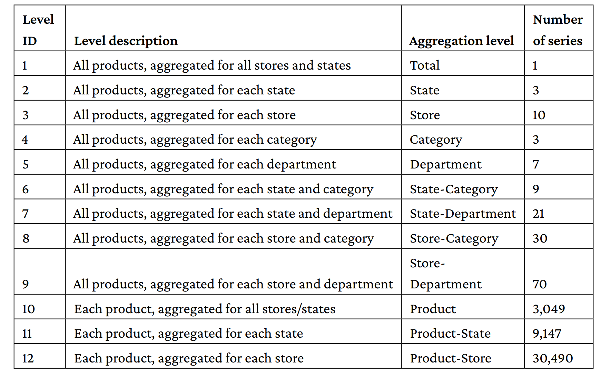

# Makridakis-Forecast-Walmart
Estimate the uncertainty distribution of Walmart unit sales.

> https://www.kaggle.com/competitions/m5-forecasting-accuracy  

## About Data
Walmart provided the data. It consisted of 42,840 daily sales time series of items hierarchically
arranged into departments, categories, and stores spread in three U.S. states (the time series are
somewhat correlated with each other). Along with the sales, Walmart also provided accompanying
information (exogenous variables, usually not often provided in forecasting problems) such as
the prices of items, some calendar information, associated promotions, or the presence of other
events affecting the sales. The data represented the USA market: it originated from 10 stores in California, Wisconsin, and Texas. Specifically, the data was made up of the sales of 3,049 products, organized into 3 categories (hobbies, food, and household) that can be divided furthermore into 7 departments each. 

### Hierarchical structure challenge: 
We can model sale dynamics at the level of the USA market, state market, single store, product category, category department, and finally, specific product.

<picture>
 <source media="(prefers-color-scheme: dark)" srcset="imgs/data-hierarchy-m5.png">
 <source media="(prefers-color-scheme: light)" srcset="imgs/data-hierarchy-m5.png">
 
</picture>

From the point of view of time, the granularity is daily sales record and covered the period spanning from January 29th 2011 to June 19th 2016, which equals to 1,969 days in total: 1,913 for training, 28 for validation (public leaderboard), and 28 for testing (private leaderboard). 

## Evaluation Metric

The accuracy competition introduced a new evaluation metric: Weighted Root Mean Squared Scaled Error (WRMSSE). You first start from the RMSSE of individual time series under scrutiny. The metric evaluates the deviation of the point forecasts around the mean of the realized values
of the series being predicted:

where:
• n is the length of the training sample
• h is the forecasting horizon (in our case, it is h =28)
• Yt is the sales value at time t; ^𝑌𝑡 is the predicted value at time t
After estimating the RMSSE for all the 42,840 time series of the competition, the Weighted RMSSE will be computed as

where wi is the weight of the ith series of the competition.

In the competition guidelines (https://mofc.unic.ac.cy/m5-competition/), in regard to RMSSE
and WRMSSE, it is stated that:
• The denominator of RMSSE is computed only for the time periods for which the examined
product(s) are actively sold, i.e., the periods following the first non-zero demand observed
for the series under evaluation.
• The measure is scale independent, meaning that it can be effectively used to compare
forecasts across series with different scales, thus you can compare the efficacy of the
model across products at different sales quantities.
• In contrast to other measures, it can be safely computed as it does not rely on divisions
with values that could be equal or close to zero (e.g., as done in percentage errors when
Yt =0 or relative errors when the error of the benchmark used for scaling is zero).
• The measure penalizes positive and negative forecast errors, as well as large and small
forecasts, equally, thus being symmetric.
• The weight of each series will be computed based on the last 28 observations of the training
sample of the dataset, i.e., the cumulative actual dollar sales that each series displayed in
that particular period (sum of units sold multiplied by their respective price).
• A lower WRMSSE is better.

### Apple MAC M1 lightgbm installation instructions

> https://towardsdatascience.com/install-xgboost-and-lightgbm-on-apple-m1-macs-cb75180a2dda
